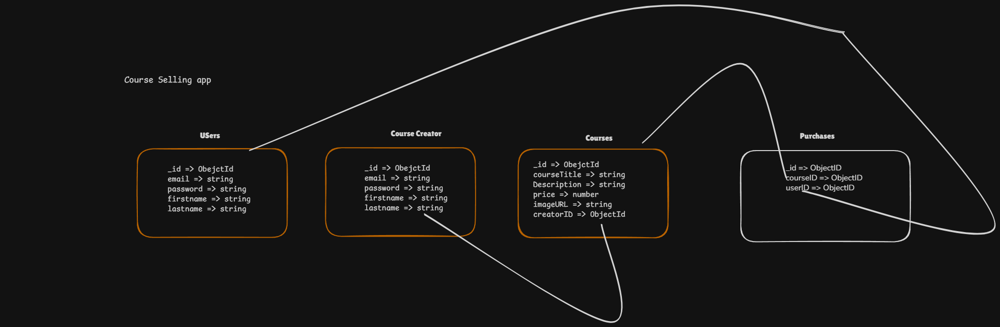

# Course Selling App Backend Notes

## 1) Big Picture
This backend project uses Express + MongoDB (Mongoose) and is split into route modules so `index.js` stays small and clean.

Why routing is useful:
- Better code organization.
- Easier to maintain and debug.
- Each route file handles one responsibility (`user`, `admin`, `course`).

## 2) Current Folder-Level Backend Structure
- `index.js`: app bootstrap, middleware setup, database connection, route mounting.
- `db.js`: all Mongoose schemas and models.
- `config.js`: reads JWT secrets from environment.
- `routes/user.js`: user signup/signin and purchase history.
- `routes/admin.js`: admin signup/signin and course management.
- `routes/course.js`: public preview and user course purchase.
- `middleware/user.js`: user auth middleware.
- `middleware/admin.js`: admin auth middleware.
- `.env`: local secrets like DB URI and JWT passwords.

## 3) Request Flow (How Data Moves)
1. Request hits `index.js`.
2. Global middleware runs (`express.json()` and rate limiter).
3. Request goes to mounted router:
    - `/api/v1/user`
    - `/api/v1/admin`
    - `/api/v1/course`
4. Protected routes run auth middleware.
5. Route handler talks to MongoDB through models from `db.js`.
6. JSON response is sent back.

## 4) Auth Design
There are two auth domains:
- User auth uses `JWT_USER_PASSWORD`.
- Admin auth uses `JWT_ADMIN_PASSWORD`.

Important idea:
- Even if same email/password is used in user and admin collections, tokens are signed with different secrets, so middleware separation still works.

Signin behavior currently:
- API returns token in JSON.
- API also sets HttpOnly cookie:
  - `userToken` for user signin.
  - `adminToken` for admin signin.

Middleware accepts token from:
- Cookie (preferred).
- Bearer token in Authorization header.
- `token` header (kept for backward compatibility).

## 5) Database Models (db.js)

### User
- `userId` (unique string)
- `email` (unique string)
- `password`
- `firstName`
- `lastName`

### Admin
- `userId` (unique string)
- `email` (unique string)
- `password`
- `firstName`
- `lastName`

### Course
- `title`
- `description`
- `content` (array of strings)
- `price`
- `imageUrl`
- `creatorId` (ObjectId)

### Purchase
- `userId` (ObjectId)
- `courseId` (ObjectId)

Why purchase table exists:
- It is a mapping table that links users to purchased courses.
- It avoids duplicating full user/course data.

## 6) Implemented Route Summary

### User Routes
- `POST /api/v1/user/signup`
- `POST /api/v1/user/signin`
- `GET /api/v1/user/purchases` (protected)

### Admin Routes
- `POST /api/v1/admin/signup`
- `POST /api/v1/admin/signin`
- `POST /api/v1/admin/course` (protected)
- `PUT /api/v1/admin/course` (protected)
- `GET /api/v1/admin/course/bulk` (protected)
- `DELETE /api/v1/admin/course/:courseId` (protected)
- `POST /api/v1/admin/course/:courseId/content` (protected)

### Course Routes
- `GET /api/v1/course/preview` (public)
- `POST /api/v1/course/purchase` (protected user route)

## 7) Global Middleware in index.js

### JSON Parser
- `express.json()` parses JSON request body.

### Rate Limiter
- In-memory per-IP limiter.
- Window: 60 seconds.
- Max: 120 requests per IP per window.
- Returns `429` when exceeded.

## 8) Environment and Scripts

### Environment Variables
- `MONGODB_URI`
- `JWT_USER_PASSWORD`
- `JWT_ADMIN_PASSWORD`

### npm Scripts
- `npm start` for normal run (`node index.js`).
- `npm run dev` for development (`nodemon index.js`).

## 9) Important Learning Notes
- Keep secrets in `.env`, not hardcoded in route files.
- Connect to DB before starting server listener.
- Protect admin routes with admin middleware and user routes with user middleware.
- Return proper status codes (403 for unauthorized, 404 for not found, 429 for rate limit).

## 10) Current Limitations (Good Next Steps)
- Passwords are plaintext right now (need hashing with bcrypt).
- Input validation (zod) is still TODO in signup/signin and some routes.
- Try/catch blocks are missing in some route handlers.
- No centralized error handler middleware yet.
- In-memory rate limiter resets on restart (for production use Redis or DB-backed limiter).

## 11) Your Original Notes (Preserved)
Below are your original notes kept for reference.

---

### notes
we wil use routing aopproch so teh index.js dont become huge
why routing?
since you know react  is statti cso its cheaper ot host all of that on cdn (content deliavry network ) compared to vbirtual machine where teh backend will be hosted if all your users are askign for html pages how much bandwith will be consumed? so its not a good idea it job is to comuting servong less

so react = cdn
backend = vm

express gives you app.use(/user, user routes)  //so all the taht start with /user are handles by userroutes
ex app.use(/user/v1, user routes).

//Databse schema are to done before
//we have cretaed what is a mapping table, it dont store the full information of courses, users , it will point to some other table in a database

//note: only start the backend of the server if database is up else it will waste of server recourses

 "start": "node index.js", //start in production, cause we not watching any files, why should i waste my recourses to keep on watching the files
     "dev" : "nodemon index.js" //when developing to keep watching
//in this peroject we are using 2 signups one for user and one for creator

so basically when im signing as an user with same email i should have a diff password and when user should have diff password ,

so even the user and admin have the same passoword and and object id, the jwts will be different for admin and user end points,
so the admin middleware will decoded using a password and the user using a diff one
so in a nut shell
const JWT_ADMIN_PASSWORD = "4fjheru4";
const JWT_USER_PASSWORD = "45fsf54";

//this file is protected by the admin middleware, so only admin can access these routes
adminRouter.use(adminMiddleware);\

now created an config.js, to store passowords etc, cause to avoid circular dependency, cause in js its very hard o debug if circular dependency is there the application might just stop , js dont giove clae4r indication.....

make sure to use dotenv cause it dont depend on anything so storing secrtes is not a proboem